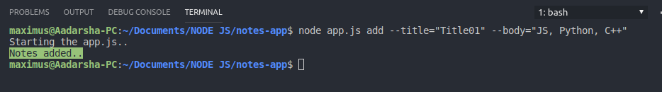
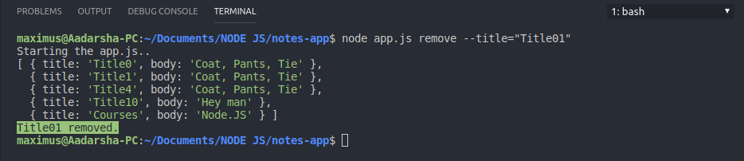
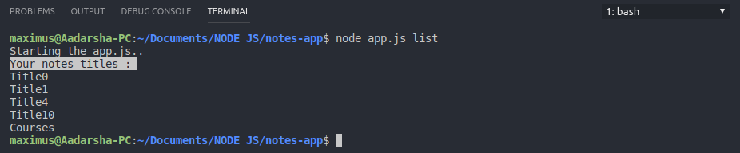
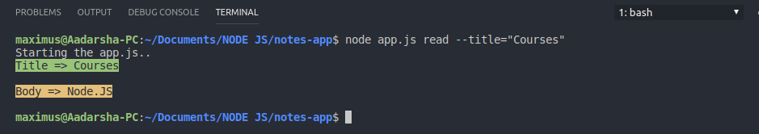

# TerminalNotes 
:memo: Terminal Notes is an app that helps to add, remove , list and read the notes via Command Line.


**Technology Used :** :computer:

- Node JS 10.15.3

- npm 6.4.1

- ES6

This app also contains ES5 version of given code in folder named ES5.

---

**How to Run The App** :running:

Make sure you have Node and npm installed. 
Open in terminal in Mac or Linux or bash shell in Windows and run the following command.

1. Clone the repo first:
```
git clone https://github.com/adarshaacharya/TerminalNotes.git

```

2. Go to that folder and run the given command : 
```
npm init
```
---
**Operations in App** :syringe:

> To add item to list :
```
node app.js add --title="title_name" --body="body_items"
```


> To remove item from list: 
```
node app.js remove --title="title_name"
```

>To view all  items in list:
```
node app.js list
```



>To view notes body from title:
```
node app.js read --title="title_name"

```


---
*Feel free to contribute and help improve the repo!*
